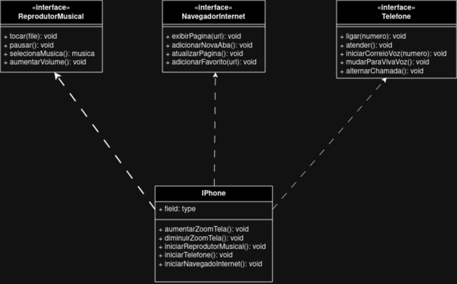

# Análise de Requisitos e Diagramação de Classes em UML
## Repósitório para a entrega do projeto DIO Bootcamp Java Backende Developer Santander

Orientação a Objetos e UML: Diagramação de Classes do iPhone

  

    
  

